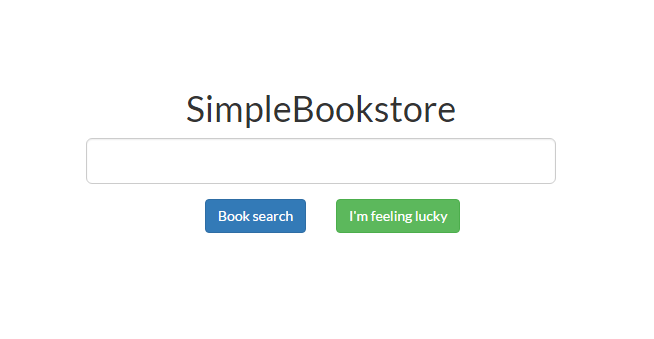
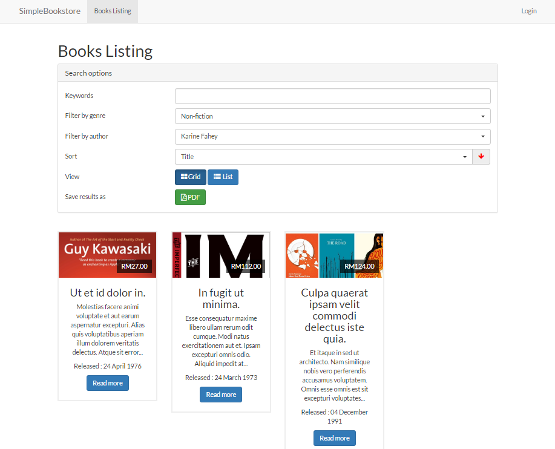
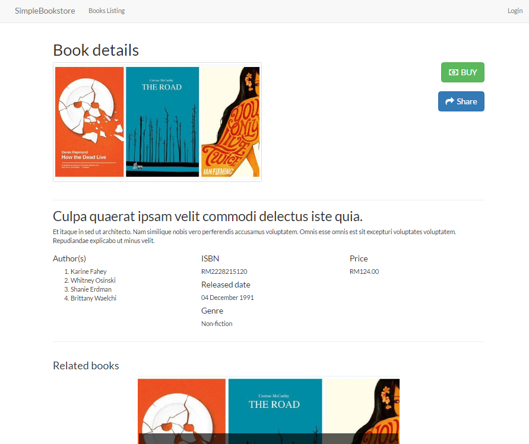
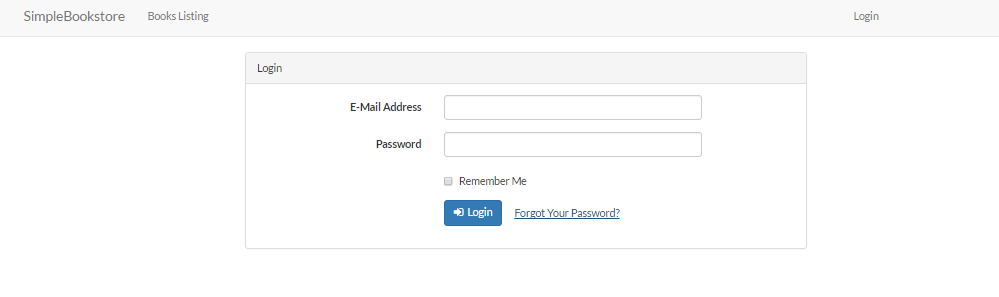
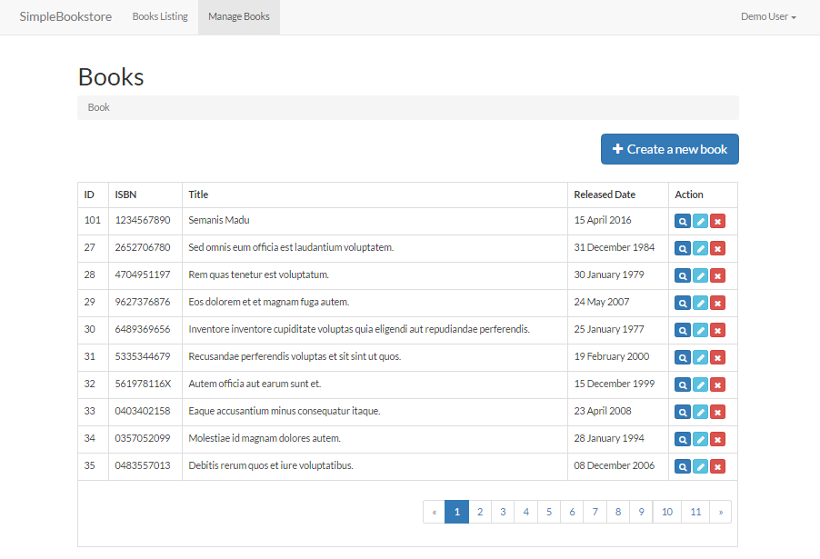
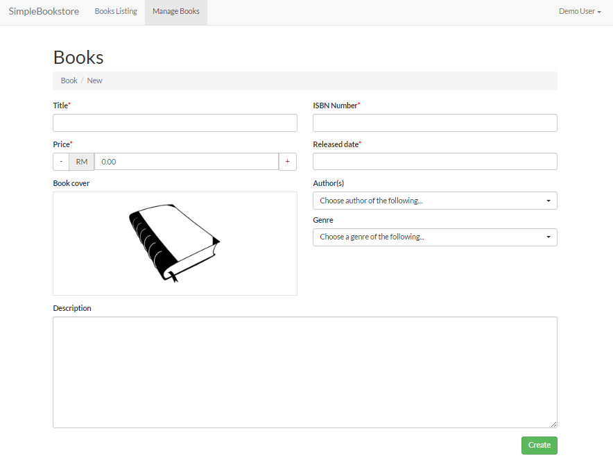

# Simple Bookstore

Hello and welcome. This is a sample application named Simple Bookstore. This app built using those technology,

- [Laravel Framework](https://github.com/laravel/laravel) - Open-sourced PHP Framework
- [Vue JS](https://github.com/vuejs/vue) - Open-sourced JS library for building interactive web interfaces.

## Demo

You can visit the demo on this application [here](http://bookstore.3kupang.com)

## Introduction

This application database consists only 5 tables, as illustrated below
 - `users`
 - `books`
 - `authors`
 - `author_book`
 - `genres`
 

 
The database design is quite straight-forward so no need more explanation :P
 
The application consists of 2 parts, first is the frontend where the guest can search for any `book`, filter, populate the `book` listing and view details of particular `book`. The second part is the backend where an authenticated `user` can manage (add, update, delete) the `book`.
 
We go through all the available routes one by one,
 
### Frontend

The frontend is where all pages can be viewed by guest. No `authentication` needed.

1. `/` The homepage, where it acts the same with Google's search page
 
    
     
2. `/books` The book listing page, where guest can search, filter, sord, export to PDF
 
    
 	 
3. `/books/{book-id}` The book details page where it shows all the details of the book
 
    
     
### Backend

The backend is where pages need `authentication`. Only authenticated user can view this page.

1. `/login`

    
 
2. `/admin/books`
 
    
 	
3. `/admin/books/new`
 
 	
 	
4. `/admin/books/{book-id}/edit`
 
    
 	
5. `/admin/books/{book-id}/show`
 
     
## Development
 
If you are interested to test this application locally,
 
 1. Forked this repository
 2. Clone.
 3. `$ composer install` | `$ bower install` | `$ npm install`
 4. `$ gulp setup`
 5. `S gulp watch` To recompile changed files.
 6. `$ php artisan migrate` and optional to run `$ php artisan db:seed`
 7. Run a web server pointed to `public/index.php`
 8. Done.