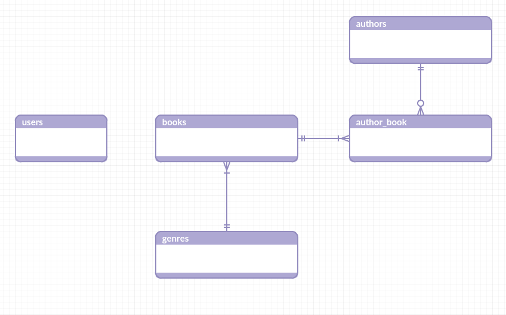

# Simple Bookstore

Hello and welcome. This is a sample application named Simple Bookstore. This app built using those technology,

- [Laravel Framework](https://github.com/laravel/laravel) - Open-sourced PHP Framework
- [Vue JS](https://github.com/vuejs/vue) - Open-sourced JS library for building interactive web interfaces.

## Introduction

This application database consists only 5 tables, as illustrated below

 - `users`
 - `books`
 - `authors`
 - `author_book`
 - `genres`
 
 
 
 The database design is quite straight-forward so no need more explanation :P
 
 The application consists of 2 parts, first is the frontend where the guest can search for any `book`, filter the `book` and view details of particular `book`. The second part is the backend where an authenticated `user` can manage (add, update, delete) the `book`.